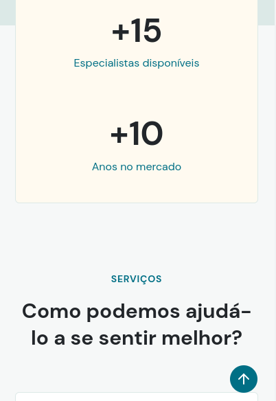

 <a href="https://site-hospitalar.vercel.app/" target="_blank"><h1 align="center">Site Hospitalar</h1></a>
 

 <h1 align="center">Site Hospitalar</h1>

 

 

 

 

 

  

<h1 align="center"> Parte do site responsivo </h1>

  
   
   
    
    
     
   
    
   
   
   
    
    
     
   
    
   

 

